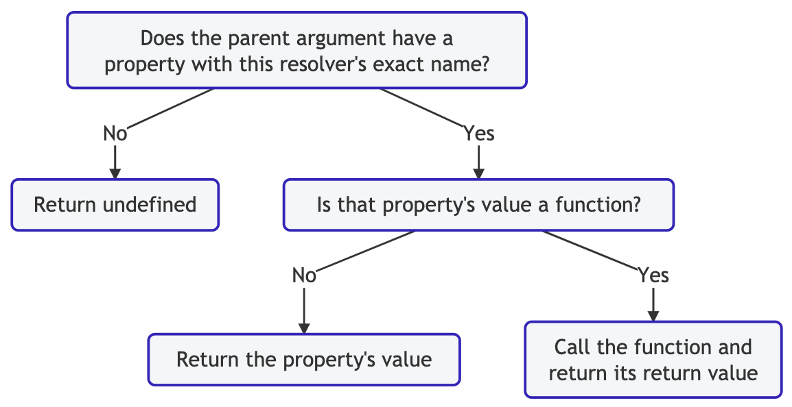

# Apollo tutorial

This is the fullstack app for the [Apollo tutorial](http://apollographql.com/docs/tutorial/introduction.html). 🚀

## File structure

The app is split out into two folders:

- `start`: Starting point for the tutorial
- `final`: Final version

From within the `start` and `final` directories, there are two folders (one for `server` and one for `client`).

## Installation

To run the app, run these commands in two separate terminal windows from the root:

```bash
cd final/server && npm i && npm start
```

and

```bash
cd final/client && npm i && npm start
```

## Notes

### [0. Introduction](https://www.apollographql.com/docs/tutorial/introduction/)

- Clone example app:

  ```sh
  git clone https://github.com/apollographql/fullstack-tutorial.git
  ```

### [1. Build a schema](https://www.apollographql.com/docs/tutorial/schema/)

- Set up Apollo Server

  ```sh
  cd fullstack-tutorial/start/server
  npm install
  npm audit fix
  ```

- In `src/index.js`:

  ```js
  const { ApolloServer } = require("apollo-server");
  const typeDefs = require("/.schema");

  // Create an instance of ApolloServer and pass it the imported schema.
  const server = new ApolloServer({ typeDefs });
  ```

- In `src/schema.js`:

  ```js
  const { gql } = require("apollo-server");

  // We'll use GraphQL's schema definition language (SDL).
  const typeDefs = gql`
    type Launch {
      id: ID!
      site: String
      mission: Mission
      rocket: Rocket
      isBooked: Boolean!
    }

    type Rocket {
      id: ID!
      name: String
      type: String
    }

    type User {
      id: ID!
      email: String!
      trips: [Launch]!
    }

    type Mission {
      name: String
      missionPatch(size: PatchSize): String
    }

    enum PatchSize {
      SMALL
      LARGE
    }

    type Query {
      launches: [Launch]!
      launch(id: ID!): Launch
      me: User
    }

    type Mutation {
      bookTrips(launchIds: [ID]!): TripUpdateResponse!
      cancelTrip(launchId: ID!): TripUpdateResponse!
      login(email: String): String # login token
    }

    type TripUpdateResponse {
      success: Boolean!
      message: String
      launches: [Launch]
    }
  `;

  module.exports = typeDefs;
  ```

- In `src/index.js`:

  ```js
  require("dotenv").config();
  const { ApolloServer } = require("apollo-server");
  const typeDefs = require("./schema");

  // Create an instance of ApolloServer and pass it the imported schema.
  const server = new ApolloServer({ typeDefs });

  // Log the URL.
  server.listen().then(({ url }) => {
    console.log(`🚀 Server ready at ${url}`);
  });
  ```

- Run `npm start`.
- Navigate to the GraphQL Playground at http://localhost:4000/

### [2. Connect to data sources](https://www.apollographql.com/docs/tutorial/data-source/)

- `src/datasources/launch.js`:

  ```js
  const { RESTDataSource } = require("apollo-datasource-rest");

  // RESTDataSource extends DataSource.
  // RESTDataSource automatically caches responses from REST resources (partial query caching).
  class LaunchAPI extends RESTDataSource {
    constructor() {
      super();
      this.baseURL = "https://api.spacexdata.com/v2/";
    }

    async getAllLaunches() {
      // RESTDataSource provides helper methods for GET, POST, etc.
      // `this.get("launches");` -> GET https://api.spacexdata.com/v2/launches.
      const response = await this.get("launches");
      return Array.isArray(response)
        ? response.map((launch) => this.launchReducer(launch))
        : [];
    }

    async getLaunchById({ launchId }) {
      const response = await this.get("launches", { flight_number: launchId });
      return this.launchReducer(response[0]);
    }

    getLaunchesByIds({ launchIds }) {
      return Promise.all(
        launchIds.map((launchId) => this.getLaunchById({ launchId }))
      );
    }

    launchReducer(launch) {
      return {
        id: launch.flight_number || 0,
        cursor: `${launch.launch_date_unix}`,
        site: launch.launch_site && launch.launch_site.site_name,
        mission: {
          name: launch.mission_name,
          missionPatchSmall: launch.links.mission_patch_small,
          missionPatchLarge: launch.links.mission_patch,
        },
        rocket: {
          id: launch.rocket.rocket_id,
          name: launch.rocket.rocket_name,
          type: launch.rocket.rocket_type,
        },
      };
    }
  }

  module.exports = LaunchAPI;
  ```

- `src/index.js`:
  - Note that, if a data source uses `this.context`, it's important to create a new instance in the `dataSources` function.
    - Otherwise, `initialize()` could get called, thereby replacing `this.context` with a different context.

```js
require("dotenv").config();
const { ApolloServer } = require("apollo-server");
const typeDefs = require("./schema");
const { createStore } = require("./utils");

const LaunchAPI = require("./datasources/launch");
const UserAPI = require("./datasources/user");

const store = createStore();

const server = new ApolloServer({
  typeDefs,
  dataSources: () => ({
    launchAPI: new LaunchAPI(),
    userAPI: new UserAPI({ store }),
  }),
});

server.listen().then(({ url }) => {
  console.log(`🚀 Server ready at ${url}`);
});
```

### [3. Write query resolvers](https://www.apollographql.com/docs/tutorial/resolvers/)

- "A resolver is a function that's responsible for populating the data for a single field in your schema."
- A resolver returns either:
  - Data of the required type.
  - A promise that fulfills with data of the required type.
- Resolver function signature:

  ```js
  fieldName: (parent, args, context, info) => data;
  ```

  - `parent`
    - Return value of the resolver for this field's parent.
      - Resolvers for parents execute before resolvers for children.
  - `args`
    - GraphQL arguments provided for the field (e.g., https://graphql.org/graphql-js/passing-arguments/).
  - `context`
    - Shared across all resolvers executing for a particular operation.
      - Use to share per-operation state (e.g., authentication information for accessing data sources).
  - `info`
    - Info about the operation's execution state.
      - Only for advanced usage.

- `src/resolvers.js`:

  - Best practice: Keep resolvers short.
    - Encapsulate logic in the data sources.

  ```js
  module.exports = {
    // Define the queries in a map, where the keys correspond to schema types...
    Query: {
      // ...and fields.
      launches: (_, __, { dataSources }) =>
        dataSources.launchAPI.getAllLaunches(),
      launch: (_, { id }, { dataSources }) =>
        dataSources.launchAPI.getLaunchById({ launchId: id }),
      me: (_, __, { dataSources }) => dataSources.userAPI.findOrCreateUser(),
    },
  };
  ```

- Add resolvers to `src/index.js`:

  ```js
  const { ApolloServer } = require("apollo-server");
  const typeDefs = require("./schema");
  const { createStore } = require("./utils");
  const resolvers = require("./resolvers");

  const LaunchAPI = require("./datasources/launch");
  const UserAPI = require("./datasources/user");

  const store = createStore();

  const server = new ApolloServer({
    typeDefs,
    resolvers,
    dataSources: () => ({
      launchAPI: new LaunchAPI(),
      userAPI: new UserAPI({ store }),
    }),
  });

  server.listen().then(({ url }) => {
    console.log(`🚀 Server ready at ${url}`);
  });
  ```

- Submit the following queries in the GraphQL Playground:

  ```graphql
  query GetLaunches {
    launches {
      id
      mission {
        name
        missionPatch
      }
    }
  }

  # Variables:
  # {
  #   "id": 60
  # }
  query GetLaunchById($id: ID!) {
    # launch(id: 60) {
    launch(id: $id) {
      id
      rocket {
        id
        type
      }
    }
  }
  ```

  - Note that `null` is returned for `missionPatch`. We need a custom resolver.
  - Apollo Server defines a default resolver for any field that doesn't have a custom resolver.
    - 

- Add resolvers for `Mission`, Launch, and User to `src/resolvers.js`:

  ```js
  module.exports = {
    // Define the queries in a map, where the keys correspond to schema types...
    Query: {
      // ...and fields.
      launches: (_, __, { dataSources }) =>
        dataSources.launchAPI.getAllLaunches(),
      launch: (_, { id }, { dataSources }) =>
        dataSources.launchAPI.getLaunchById({ launchId: id }),
      me: (_, __, { dataSources }) => dataSources.userAPI.findOrCreateUser(),
    },
    Mission: {
      // Default size: 'LARGE'.
      missionPatch: (mission, { size } = { size: "LARGE" }) => {
        return size === "SMALL"
          ? mission.missionPatchSmall
          : mission.missionPatchLarge;
      },
    },
    Launch: {
      isBooked: async (launch, _, { dataSources }) => {
        dataSources.userAPI.isBookedOnLaunch({ launchId: launch.id });
      },
    },
    User: {
      trips: async (_, __, { dataSources }) => {
        // Get IDs of launches by user.
        const launchIds = await dataSources.userAPI.getLaunchIdsByUser();
        if (!launchIds.length) return [];
        // Look up those launches by their IDs.
        return (
          dataSources.launchAPI.getLaunchesByIds({
            launchIds,
          }) || []
        );
      },
    },
  };
  ```

- Recommendation for numbered pages: Cursor-based pagination.
  - Prevents skipping an item or displaying the same item multiple times.
  - A constant pointer (or cursor) keeps track of where to start the next set of results.
- Update `src/schema.js` to use cursor-based pagination:

```js
// ...
const typeDefs = gql`
  # ...

  """
  Simple wrapper around our list of launches that contains a cursor to the
  last item in the list. Pass this cursor to the launches query to fetch
  results after these.
  """
  type LaunchConnection {
    cursor: String!
    hasMore: Boolean!
    launches: [Launch]!
  }

  # ...

  type Query {
    launches(
      """
      The number of results to show. Must be >= 1. Default = 20.
      """
      pageSize: Int
      """
      If you add a cursor here, it will only return results _after_ this cursor.
      """
      after: String
    ): LaunchConnection!
    launch(id: ID!): Launch
    me: User
  }
  # ...
`;
```

- Update `src/resolvers.js` to use pagination:

```js
const { paginateResults } = require("./utils");

module.exports = {
  // Define the queries in a map, where the keys correspond to schema types...
  Query: {
    // ...and fields.
    launches: async (_, { pageSize = 20, after }, { dataSources }) => {
      const allLaunches = await dataSources.launchAPI.getAllLaunches();
      // Get reverse chronological order.
      allLaunches.reverse();
      const launches = paginateResults({
        after,
        pageSize,
        results: allLaunches,
      });
      return {
        launches,
        cursor: launches.length ? launches[launches.length - 1].cursor : null,
        // If the cursor at the end of the paginated results is the final item in _all_ results,
        // there are no more results.
        hasMore: launches.length
          ? launches[launches.length - 1].cursor !==
            allLaunches[allLaunches.length - 1].cursor
          : false,
      };
    },
    // ...
  },
  // ...
};
// ...
```

- Try out a query using pagination. Only 3 launches should be returned.

  ```graphql
  query GetLaunches {
    launches(pageSize: 3) {
      launches {
        id
        mission {
          name
          missionPatch
        }
      }
    }
  }
  ```

### [Write mutation resolvers](https://www.apollographql.com/docs/tutorial/mutation-resolvers/)

- Note: The authentication method used in this tutorial is not secure and should not be used in production systems.
- Add a `login` mutation to `src/resolvers.js`:

  ```js
  const { paginateResults } = require("./utils");

  module.exports = {
    // ...
    Mutation: {
      login: async (_, { email }, { dataSources }) => {
        // Return a login token based on a user's email address.
        const user = await dataSources.userAPI.findOrCreateUser({ email });
        if (user) return Buffer.from(email).toString("base64");
      },
    },
    // ...
  };
  ```

- In `src/index.js`, perform authentication based on the Mutation.login token.

  - The `context` function is called once for each GraphQL operation received from clients.
    - The return value becomes the `context` argument passed to each resolver that runs for the operation.
    - Since the `context` is created at the beginning of each operation's execution, all resolvers can access details for that logged-in user and perform actions accordingly.

  ```js
  const isEmail = require("isemail");
  // ...
  const server = new ApolloServer({
    /*
      1. Get the `Authorization` header value (if any).
      2. Decode the `Authorization` header value.
      3. If the value is an email address, retrieve the user. Return the `user` in an object.
    */
    context: async ({ req }) => {
      // Perform simple auth check on each request.
      const auth = (req.headers && req.headers.authorization) || "";
      const email = Buffer.from(auth, "base64").toString("ascii");
      if (!isEmail.validate(email)) return { user: null };
      // Find user by email.
      const users = await store.users.findOrCreate({ where: { email } });
      const user = (users && users[0]) || null;
      if (user === null) {
        return { user: null };
      }
      return { user: { ...user.dataValues } };
    },
    // ...
  });
  // ...
  ```

- In `src/resolvers.js`, add `bookTrips` and `cancelTrip` mutations:

  ```js
  // ...
  module.exports = {
    // ...
    Mutation: {
      // ...
      bookTrips: async (_, { launchIds }, { dataSources }) => {
        const results = await dataSources.userAPI.bookTrips({ launchIds });
        const launches = await dataSources.launchAPI.getLaunchesByIds({
          launchIds,
        });
        return {
          success: results && results.length === launchIds.length,
          message:
            results.length === launchIds.length
              ? "trips booked successfully"
              : `the following launches couldn't be booked: ${launchIds.filter(
                  (id) => !results.includes(id)
                )}`,
          launches,
        };
      },
      cancelTrip: async (_, { launchId }, { dataSources }) => {
        const result = await dataSources.userAPI.cancelTrip({ launchId });
        if (!result)
          return {
            success: false,
            message: "failed to cancel trip",
          };
        const launch = await dataSources.launchAPI.getLaunchById({ launchId });
        return {
          success: true,
          message: "trip cancelled",
          launches: [launch],
        };
      },
    },
    // ...
  };
  ```

- Test out a mutation.

  - Obtain a login token:

    ```graphql
    mutation LoginUser {
      login(email: "daisy@apollographql.com")
    }
    ```

    - Example response (base64 encoding of supplied email address):

      ```json
      {
        "data": {
          "login": "ZGFpc3lAYXBvbGxvZ3JhcGhxbC5jb20="
        }
      }
      ```

  - Book trips:

    - Supply HTTP header:

      ```json
      {
        "authorization": "ZGFpc3lAYXBvbGxvZ3JhcGhxbC5jb20="
      }
      ```

    ```graphql
    mutation BookTrips {
      bookTrips(launchIds: [67, 68, 69]) {
        success
        message
        launches {
          id
        }
      }
    }
    ```

    - Example response:

    ```json
    {
      "data": {
        "bookTrips": {
          "success": true,
          "message": "trips booked successfully",
          "launches": [
            {
              "id": "67"
            },
            {
              "id": "68"
            },
            {
              "id": "69"
            }
          ]
        }
      }
    }
    ```

### [5. Connect your graph to Apollo Studio](https://www.apollographql.com/docs/tutorial/production/)

- Create an account (free) at [https://studio.apollographql.com/](https://studio.apollographql.com/).
- Create a graph:
  - Click `New Graph`.
  - Provide a name and click `Next`.
- Create a `.env` file (USED BY `dotenv`) and supply the API key:

  ```properties
  APOLLO_KEY=PAST_KEY_HERE
  APOLLO_SCHEMA_REPORTING=true
  ```

- Explore.

### [6. Set up Apollo Client](https://www.apollographql.com/docs/tutorial/client/)

- Install dependencies:

  ```sh
  cd start/client
  npm install
  npm audit fix
  ```

- Recommendation: Apollo VS Code extension

  ```sh
  code --install-extension apollographql.vscode-apollo
  ```

  - The VS Code extension uses an API key to connect to Apollo Studio. Create an `.env` file in `start/client/`:

    ```properties
    ENGINE_API_KEY=PASTE_YOUR_KEY_HERE
    ```

    - Note that the docs are misleading. The property should be `ENGINE_API_KEY`, not `APOLLO_KEY`.

- In `apollo.config.js`, configure the behavior of the Apollo VS Code extension and the Apollo CLI:

  ```js
  module.exports = {
    client: {
      name: "Space Explorer [web]",
      service: "GRAPH_NAME",
    },
  };
  ```

- To generate TypeScript types for queries & mutations:

  ```sh
  npm run codegen
  ```

- In `src/index.tsx`, create an instance of `ApolloClient`. With these lines, our client is ready to fetch data.

  ```tsx
  import {
    ApolloClient,
    InMemoryCache,
    gql,
    NormalizedCacheObject,
  } from "@apollo/client";

  const client: ApolloClient<NormalizedCacheObject> = new ApolloClient({
    // URI of our GraphQL server.
    uri: "http://localhost:4000/",
    // Instance of InMemoryCache to use as the client's cache.
    cache: new InMemoryCache(),
  });
  ```

- To test it out, add the following to `src/index.tsx`:

  ```tsx
  client
    .query({
      query: gql`
        query TestQuery {
          launch(id: 56) {
            id
            mission {
              name
            }
          }
        }
      `,
    })
    .then((result) => console.log(result));
  ```

  - Start the client:

    ```sh
    npm start
    ```

    - The response should be logged in the browser console at http://localhost:3000/.

    ```json
    {
      "data": {
        "launch": {
          "id": "56",
          "mission": { "name": "Paz / Starlink Demo", "__typename": "Mission" },
          "__typename": "Launch"
        }
      }
    }
    ```

  - Remove the block.

- Connect Apollo Client to React. Update `src/index.tsx` to the following:

  ```tsx
  import {
    ApolloClient,
    ApolloProvider,
    InMemoryCache,
    NormalizedCacheObject,
  } from "@apollo/client";
  import React from "react";
  import ReactDOM from "react-dom";
  import Pages from "./pages";
  import injectStyles from "./styles";

  const client: ApolloClient<NormalizedCacheObject> = new ApolloClient({
    // URI of our GraphQL server.
    uri: "http://localhost:4000/",
    // Instance of InMemoryCache to use as the client's cache.
    cache: new InMemoryCache(),
  });

  injectStyles();
  ReactDOM.render(
    // Inject our client into the ApolloProvider.
    <ApolloProvider client={client}>
      <Pages />
    </ApolloProvider>,
    document.getElementById("root")
  );
  ```

### [Fetch data with queries](https://www.apollographql.com/docs/tutorial/queries/)

#### Fetching a list

- In `src/pages/launches.tsx`, import `useQuery` and `gql` from `@apollo/client` and define `GET_LAUNCHES`.

  ```tsx
  import React, { Fragment } from "react";
  import { gql, useQuery } from "@apollo/client";

  import { LaunchTile, Header, Button, Loading } from "../components";
  import { RouteComponentProps } from "@reach/router";
  import * as GetLaunchListTypes from "./__generated__/GetLaunchList";

  // Define a query.
  const GET_LAUNCHES = gql`
    query launchList($after: String) {
      launches(after: $after) {
        cursor
        hasMore
        launches {
          id
          # isBooked
          rocket {
            id
            name
          }
          mission {
            name
            missionPatch
          }
        }
      }
    }
  `;

  interface LaunchesProps extends RouteComponentProps {}

  export const LAUNCH_TILE_DATA = gql`
    fragment LaunchTile on Launch {
      __typename
      id
      # isBooked
      rocket {
        id
        name
      }
      mission {
        name
        missionPatch
      }
    }
  `;

  interface LaunchesProps extends RouteComponentProps {}

  // Pass the query to Apollo's useQuery hook and render the list.
  const Launches: React.FC<LaunchesProps> = () => {
    const { data, loading, error } = useQuery<
      GetLaunchListTypes.GetLaunchList,
      GetLaunchListTypes.GetLaunchListVariables
    >(GET_LAUNCHES);

    if (loading) return <Loading />;
    if (error) return <p>ERROR</p>;
    if (!data) return <p>Not Found</p>;
    return (
      <Fragment>
        <Header />
        {data.launches?.launches?.map((launch: any) => (
          <LaunchTile key={launch.id} launch={launch} />
        ))}
      </Fragment>
    );
  };

  export default Launches;
  ```

#### Build a paginated list

- If more launches are available in the query, render a `Load More` button. When clicked, call the `fetchMore` function from Apollo.

  ```tsx
  import React, { Fragment } from "react";
  import { gql, useQuery } from "@apollo/client";

  import { LaunchTile, Header, Button, Loading } from "../components";
  import { RouteComponentProps } from "@reach/router";
  import * as GetLaunchListTypes from "./__generated__/GetLaunchList";

  // Define a query.
  const GET_LAUNCHES = gql`
    query launchList($after: String) {
      launches(after: $after) {
        cursor
        hasMore
        launches {
          id
          # isBooked
          rocket {
            id
            name
          }
          mission {
            name
            missionPatch
          }
        }
      }
    }
  `;

  interface LaunchesProps extends RouteComponentProps {}

  // Pass the query to Apollo's useQuery hook and render the list.
  const Launches: React.FC<LaunchesProps> = () => {
    const { data, loading, error, fetchMore } = useQuery<
      GetLaunchListTypes.GetLaunchList,
      GetLaunchListTypes.GetLaunchListVariables
    >(GET_LAUNCHES);

    if (loading) return <Loading />;
    if (error) return <p>ERROR</p>;
    if (!data) return <p>Not Found</p>;
    return (
      <Fragment>
        <Header />
        {data?.launches?.launches?.map((launch: any) => (
          <LaunchTile key={launch.id} launch={launch} />
        ))}
        {data?.launches?.hasMore && (
          <Button
            onClick={() =>
              fetchMore({
                variables: { after: data?.launches?.cursor },
                // Tell Apollo how to update the list of launches in the cache:
                // Merge the previous result and the new query result.
                updateQuery: (prev, { fetchMoreResult, ...rest }) => {
                  if (!fetchMoreResult) return prev;
                  return {
                    ...fetchMoreResult,
                    launches: {
                      ...fetchMoreResult?.launches,
                      launches: [
                        ...prev?.launches?.launches,
                        ...fetchMoreResult?.launches?.launches,
                      ],
                    },
                  };
                },
              })
            }
          >
            Load More
          </Button>
        )}
      </Fragment>
    );
  };

  export default Launches;
  ```

#### Fetching a single launch

- In `src/pages/launch.tsx`, provide `launchId` (via prop from the router) to the query via `variables`.

  ```tsx
  import React, { Fragment } from "react";
  import { gql, useQuery } from "@apollo/client";

  import { Loading, Header, LaunchDetail } from "../components";
  import { ActionButton } from "../containers";
  import { RouteComponentProps } from "@reach/router";
  import * as LaunchDetailTypes from "./__generated__/LaunchDetails";

  export const GET_LAUNCH_DETAILS = gql`
    query LaunchDetails($launchId: ID!) {
      launch(id: $launchId) {
        id
        site
        # isBooked
        rocket {
          id
          name
          type
        }
        mission {
          name
          missionPatch
        }
      }
    }
  `;

  interface LaunchProps extends RouteComponentProps {
    launchId?: any;
  }

  const Launch: React.FC<LaunchProps> = ({ launchId }) => {
    const { data, loading, error } = useQuery<
      LaunchDetailTypes.LaunchDetails,
      LaunchDetailTypes.LaunchDetailsVariables
    >(GET_LAUNCH_DETAILS, { variables: { launchId } });

    if (loading) return <Loading />;
    if (error) return <p>ERROR: {error?.message}</p>;
    if (!data) return <p>Not found</p>;

    return (
      <Fragment>
        <Header image={data?.launch?.mission?.missionPatch}>
          {data?.launch?.mission?.name}
        </Header>
        <LaunchDetail {...data?.launch} />
        <ActionButton {...data?.launch} />
      </Fragment>
    );
  };

  export default Launch;
  ```

#### Using fragments to share code

- Define and incorporate a `LAUNCH_TILE_DATA` fragment.

  - `src/pages/launches.tsx`:

    ```tsx
    import React, { Fragment } from "react";
    import { gql, useQuery } from "@apollo/client";

    import { LaunchTile, Header, Button, Loading } from "../components";
    import { RouteComponentProps } from "@reach/router";
    import * as GetLaunchListTypes from "./__generated__/GetLaunchList";

    export const LAUNCH_TILE_DATA = gql`
      fragment LaunchTile on Launch {
        id
        # isBooked
        rocket {
          id
          name
        }
        mission {
          name
          missionPatch
        }
      }
    `;

    // Define a query.
    const GET_LAUNCHES = gql`
      query launchList($after: String) {
        launches(after: $after) {
          cursor
          hasMore
          launches {
            ...LaunchTile
          }
        }
      }
      ${LAUNCH_TILE_DATA}
    `;

    interface LaunchesProps extends RouteComponentProps {}

    // Pass the query to Apollo's useQuery hook and render the list.
    const Launches: React.FC<LaunchesProps> = () => {
      const { data, loading, error, fetchMore } = useQuery<
        GetLaunchListTypes.GetLaunchList,
        GetLaunchListTypes.GetLaunchListVariables
      >(GET_LAUNCHES);

      if (loading) return <Loading />;
      if (error) return <p>ERROR</p>;
      if (!data) return <p>Not Found</p>;
      return (
        <Fragment>
          <Header />
          {data>.launches?.launches?.map((launch: any) => (
            <LaunchTile key={launch.id} launch={launch} />
          ))}
          {data?.launches?.hasMore && (
            <Button
              onClick={() =>
                fetchMore({
                  variables: { after: data.launches?.cursor },
                  // Tell Apollo how to update the list of launches in the cache:
                  // Merge the previous result and the new query result.
                  updateQuery: (prev, { fetchMoreResult, ...rest }) => {
                    if (!fetchMoreResult) return prev;
                    return {
                      ...fetchMoreResult,
                      launches: {
                        ...fetchMoreResult?.launches,
                        launches: [
                          ...prev?.launches?.launches,
                          ...fetchMoreResult?.launches?.launches,
                        ],
                      },
                    };
                  },
                })
              }
            >
              Load More
            </Button>
          )}
        </Fragment>
      );
    };

    export default Launches;
    ```

  - `src/pages/launch.tsx`:

    ```tsx
    import React, { Fragment } from "react";
    import { gql, useQuery } from "@apollo/client";

    import { Loading, Header, LaunchDetail } from "../components";
    import { ActionButton } from "../containers";
    import { RouteComponentProps } from "@reach/router";
    import * as LaunchDetailTypes from "./__generated__/LaunchDetails";
    import { LAUNCH_TILE_DATA } from "./launches";

    export const GET_LAUNCH_DETAILS = gql`
      query LaunchDetails($launchId: ID!) {
        launch(id: $launchId) {
          ...LaunchTile
        }
      }
      ${LAUNCH_TILE_DATA}
    `;

    interface LaunchProps extends RouteComponentProps {
      launchId?: any;
    }

    const Launch: React.FC<LaunchProps> = ({ launchId }) => {
      const { data, loading, error } = useQuery<
        LaunchDetailTypes.LaunchDetails,
        LaunchDetailTypes.LaunchDetailsVariables
      >(GET_LAUNCH_DETAILS, { variables: { launchId } });

      if (loading) return <Loading />;
      if (error) return <p>ERROR: {error?.message}</p>;
      if (!data) return <p>Not found</p>;

      return (
        <Fragment>
          <Header image={data?.launch?.mission?.missionPatch}>
            {data?.launch?.mission?.name}
          </Header>
          <LaunchDetail {...data?.launch} />
          <ActionButton {...data?.launch} />
        </Fragment>
      );
    };

    export default Launch;
    ```

#### Customizing the fetch policy

- We can customize the `useQuery`'s `fetchPolicy`, such as to bypass the cache for data that shouldn't be stale.

  - Default policy: `cache-first`.
    - Check the cache to see if it's there before making a network request.
  - To always retrieve new data: `network-only`.

    ```tsx
    import React, { Fragment } from "react";
    import { gql, useQuery } from "@apollo/client";

    import { Loading, Header, LaunchTile } from "../components";
    import { LAUNCH_TILE_DATA } from "./launches";
    import { RouteComponentProps } from "@reach/router";
    import * as GetMyTripsTypes from "./__generated__/GetMyTrips";

    export const GET_MY_TRIPS = gql`
      query GetMyTrips {
        me {
          id
          email
          trips {
            ...LaunchTile
          }
        }
      }
      ${LAUNCH_TILE_DATA}
    `;

    interface ProfileProps extends RouteComponentProps {}

    const Profile: React.FC<ProfileProps> = () => {
      const { data, loading, error } = useQuery<
        GetMyTripsTypes.GetMyTrips,
        any
      >(GET_MY_TRIPS, { fetchPolicy: "network-only" });

      if (loading) return <Loading />;
      if (error) return <p>ERROR: {error?.message}</p>;
      if (!data) return <p>Not Found</p>;

      return (
        <Fragment>
          <Header>My Trips</Header>
          {data?.me?.trips?.length ? (
            data?.me?.trips?.map((launch: any) => (
              <LaunchTile key={launch.id} launch={launch} />
            ))
          ) : (
            <p>You haven't booked any trips</p>
          )}
        </Fragment>
      );
    };

    export default Profile;
    ```

- Until we implement the login feature, however, no trips will load at http://localhost:3000/profile.
